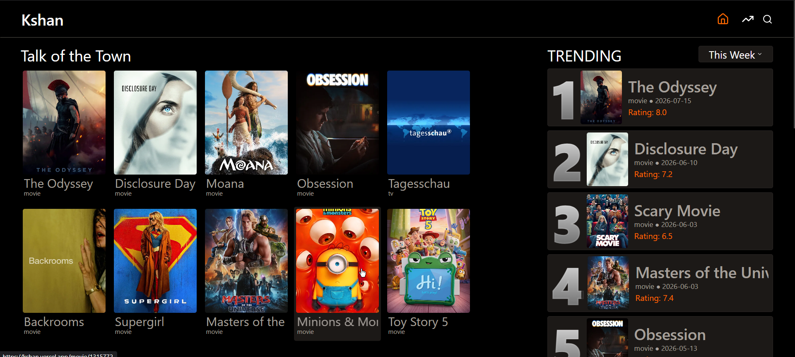

# Kshan

A modern movie and TV discovery platform built with React, Vite, and the TMDB API.

Explore trending movies, TV shows, and people through a clean interface featuring detailed pages, search functionality, dynamic routing, and carefully designed loading, error, and empty states.



---

## Features

- 🔥 Browse trending movies and TV shows
- 🎬 Detailed pages for movies and TV series
- 👤 Dedicated pages for actors and actresses
- 🔍 Search across movies, TV shows, and people
- ⭐ Critically acclaimed recommendations
- 🖼️ Lazy-loaded images with graceful placeholders
- ⚡ Skeleton loading screens
- 🚨 Error and empty state handling
- 🧭 Dynamic routing using React Router

---

## 🛠 Tech Stack

| Category | Technologies |
|----------|--------------|
| Frontend | React, Vite |
| Styling | Tailwind CSS |
| Routing | React Router |
| API | TMDB API |
| HTTP | Axios |
| Deployment | Vercel |

---

## Screenshots

### Home

(./src/screenshots/Home.png)

### Search

(./src/screenshots/Search.png)

### Trending

(./src/screenshots/Trending.png)

### Movie Details

(./src/screenshots/detailsHero.png)
(./src/screenshots/detailsCastReview.png)

---

## Getting Started

```bash
git clone https://github.com/yourusername/moctale.git

cd moctale

npm install

npm run dev
```

Create a `.env` file.

```env
VITE_TMDB_TOKEN=your_tmdb_access_token
```

---

## Project Structure

```
src
├── assets
├── components
├── pages
├── services
├── utils
├── hooks
└── router
```

---

## Challenges

Some of the interesting problems solved while building Moctale include:

- Normalizing different TMDB response formats
- Handling movie, TV, and person routes dynamically
- Building reusable loading, error, and empty states
- Managing asynchronous API requests cleanly
- Deploying a Vite application to Vercel

---

## Future Improvements

- User authentication
- Personal watchlists
- Favorites
- Advanced filters
- Infinite scrolling
- Improved accessibility
- Light mode

---

## Acknowledgements

This product uses the TMDB API but is not endorsed or certified by TMDB.